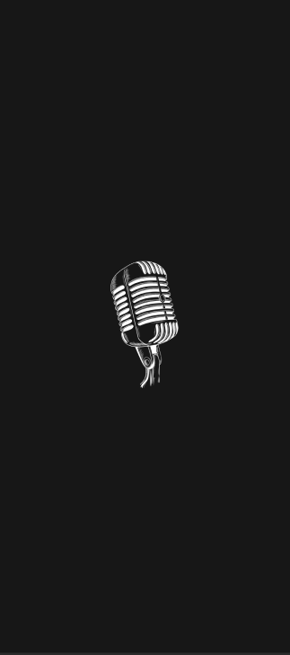
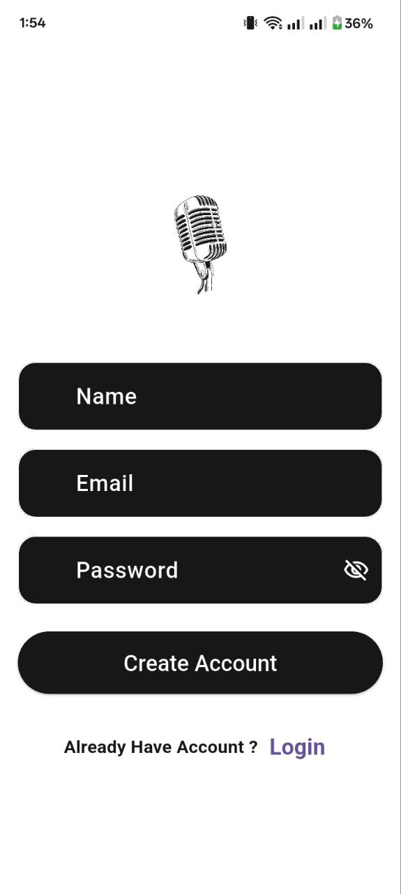
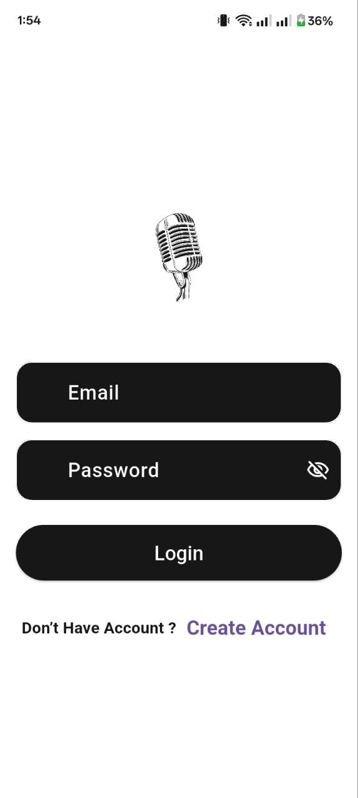
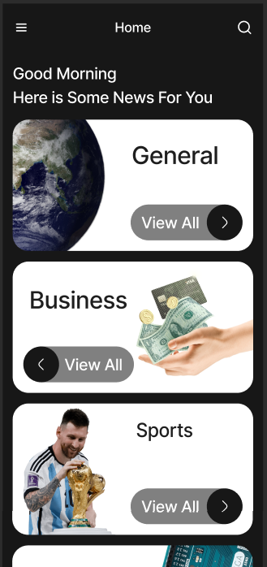
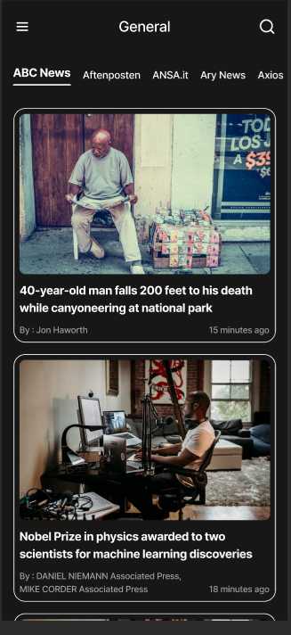
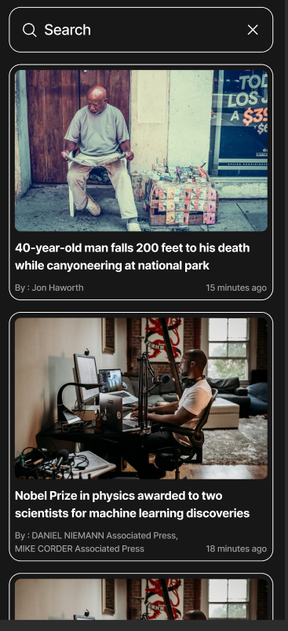

# News App
A modern Flutter news application that delivers categorized and source-based news through the News API, with Firebase authentication, personalized theme preferences, and a responsive user experience.

---

## 📱 App Preview

### Screenshots

| Splash                            | Register                           | Login                          |
| --------------------------------- | ------------------------------- | ----------------------------- |
|  |  |  |

| Home                                | News                          | Search                        |
| ----------------------------------------- | ----------------------------- | ----------------------------------- |
|  |  |  |


---

##  Demo

**Recorded Demo:** [Add your demo link here]

The demo covers the main application flow, including authentication, browsing categories and news, theme switching, and the main app features.

---

##  Features

* Splash Screen
* User Authentication: Login, Register & Logout
* Firebase Authentication & Firestore
* Browse news by categories and sources
* Search categories
* Latest news with `timeago`
* Light & Dark Theme
* Persistent preferences using Shared Preferences
* Responsive UI using ScreenUtil
* Custom App Icon

---

##  Implementation Approach

The application follows **MVVM architecture** to keep the UI, business logic, and data handling separated and maintainable.

### State Management

**Cubit & States** are used for news and sources because they provide a simple and predictable way to manage:

* Loading states
* Successfully fetched data
* Error states

### API Integration

The **News API** is used to retrieve news articles and sources dynamically instead of using static data.

### Firebase

**Firebase Authentication** handles user registration, login, and logout, while **Cloud Firestore** is used for storing user-related data.

### Local Storage

**Shared Preferences** is used to persist lightweight local settings, such as the selected theme, so the preference remains after reopening the app.

### Responsive UI

**ScreenUtil** is used to make dimensions and text adapt to different screen sizes.

### Time Formatting

**Timeago** converts article publication timestamps into user-friendly formats such as "5 minutes ago".

---

##  Technologies

* Flutter & Dart
* MVVM Architecture
* Cubit / Flutter Bloc
* News API
* Firebase Authentication
* Cloud Firestore
* Shared Preferences
* ScreenUtil
* Timeago
* responsive UI  by Screen Util & Media Query
* Provider for manage Theming 

---

##  Setup & Installation

### 1. Clone the repository

```bash
git clone YOUR_GITHUB_REPO_URL
cd news
```

### 2. Install dependencies

```bash
flutter pub get
```

### 3. Configure Firebase

Add your Firebase configuration file:

```text
android/app/google-services.json
```

Make sure the Firebase Android package name matches the application's package name.

### 4. Configure News API

Add your News API key according to the project's API configuration.

### 5. Run the application

```bash
flutter run
```

---

##  Design & API

* **UI Design:** [Figma Design](https://www.figma.com/design/BkfHUIqlJ6s3qwVZbE3LSH/News--Internship?node-id=0-1&t=0Dl60hiTmak5vjnj-1)
* **API Documentation:** [News API](https://newsapi.org/docs)

---

## 📂 Architecture

```text
lib/
├── core/
│   ├── constants/
│   ├── helper/
│   ├── models/
│   ├── provider/
│   ├── Theme/
│   ├── utils/
│   ├── widgets/
│   └── firebase_service.dart
├── features/
│   ├── Auth/
│   ├── category/
│   ├── home/
│   └── news/
└── main.dart
```

The project is organized by features to keep related screens, models, logic, and services together and make the codebase easier to maintain and extend.

---

##  Author

**Aya Mohamed**

Computer Engineering Graduate
Flutter Developer
